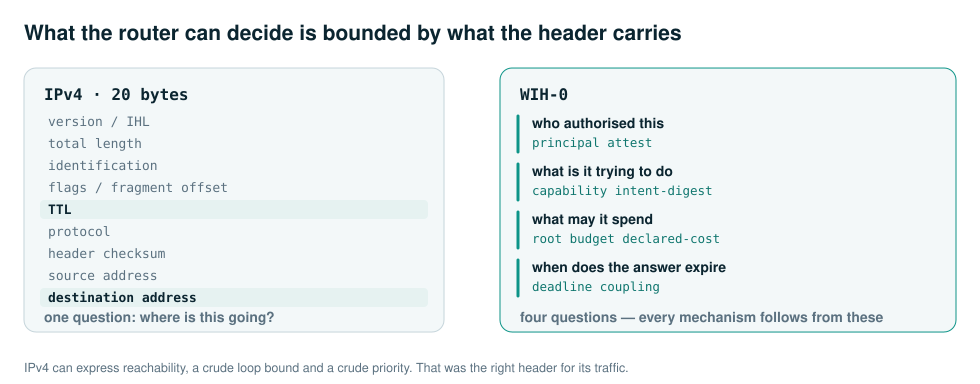
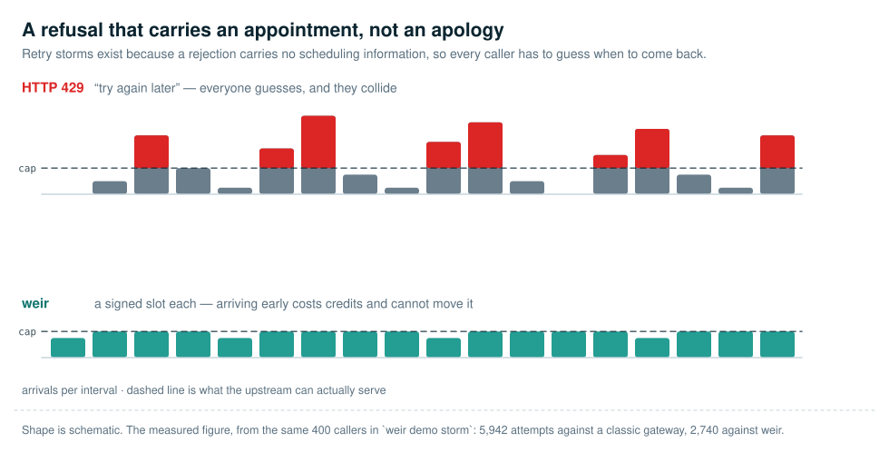
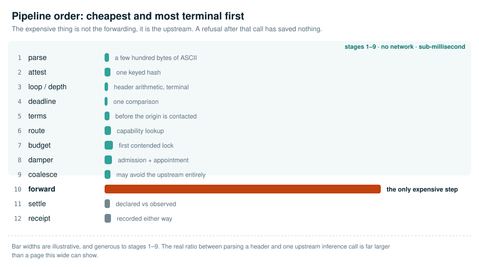
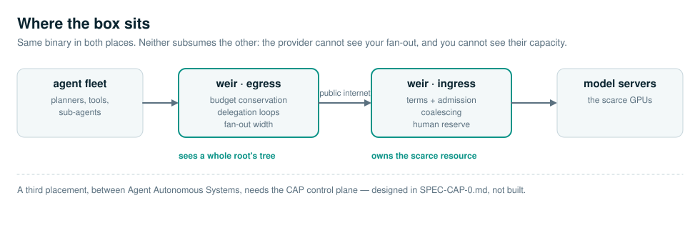
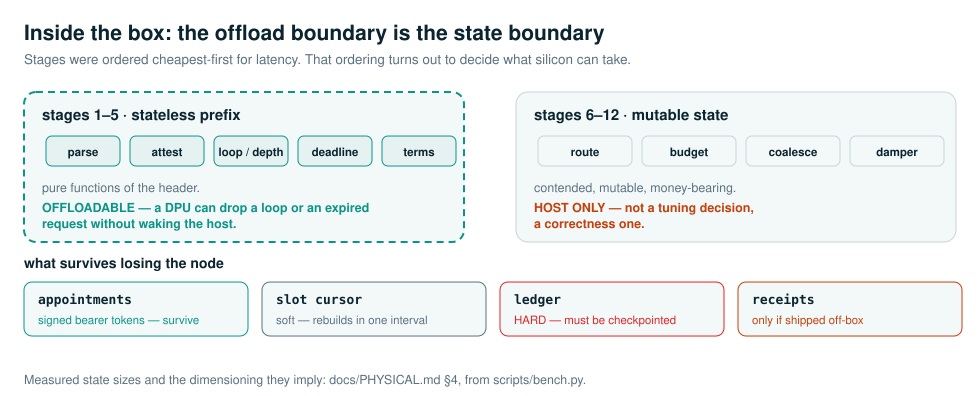

<picture>
  <source media="(prefers-color-scheme: dark)" srcset="docs/assets/banner-dark.svg">
  
</picture>

<a href="LICENSE"></a>
<a href="#run-it"></a>


A weir is the thing in a river that does not dam it. It shapes the flow, meters
the discharge, and makes an otherwise unmeasurable river accountable. That is
the ambition here: not a wall in front of the agent internet, but the piece of
infrastructure that makes it survivable.

---

## The argument

A classical router forwards on **address**, meters **bytes**, prevents loops
with a **hop counter**, and assumes **endpoints cooperate**. Those four
assumptions carried the internet for forty years. Agent traffic falsifies all
four at once:

| Classical mechanism | The assumption | Why it fails on agent traffic |
|---|---|---|
| Longest-prefix match on destination IP | An address identifies who you are talking to | The address identifies which datacentre an agent rents. It says nothing about *whose authority* it acts under — which is the only thing you would want to route, rate-limit or bill on. |
| Byte counters, MTU, shapers | Bytes approximate cost | A 300-byte request saying "research this and cite twelve sources" commissions more compute than a 4 MB file transfer. On this network the correlation is not weak, it is *inverted*: the cheap-looking request is the one that fans out. |
| TTL / hop limit | Loops are topological | A researcher calls a summariser calls a search tool calls the researcher. Three hosts, three addresses, three healthy connections, no topological loop at all. A hop counter cannot see it, and 255 laps of an agent loop is a five-figure invoice. |
| DiffServ / DSCP | Traffic class is a property of the flow, recognisable by protocol | A request a person is waiting for and a request from a nightly crawl are the same verb, same payload shape, same TLS session, same model. No port number separates them, because the difference is not in the packet. |
| TCP AIMD congestion control | Endpoints slow down when the network hurts | Every agent framework ships a retry decorator. HTTP 429 is *free to ignore*, so the locally rational move for each agent is to retry immediately, and the aggregate is the storm that turns a brownout into an outage. |

Weir replaces each one. The header it forwards on answers four questions
instead of one — *who authorised this, what is it trying to do, what may it
spend, when does the answer expire* — and every mechanism below falls out of
having those four answers at the hop.

<picture>
  <source media="(prefers-color-scheme: dark)" srcset="docs/assets/header-dark.svg">
  
</picture>

---

## The five mechanisms

 **1. Delegation path vector.** BGP solved
"carry where you have been, refuse anything that has been through you" in 1994.
Weir applies AS_PATH semantics to delegation instead of topology, so a 3-cycle
dies on its first repetition while a legitimate 12-stage pipeline is untouched. A
hop limit can do neither.

 **2. Budget conserved across fan-out.** Budget
belongs to the *root* request — every descendant of one human action shares a
root, and the router's ledger is authoritative while the header's number is
advisory, exactly as TTL is authoritative in the network rather than at the
sender. The consequence:

> An agent swarm cannot spend more than its root was granted, no matter how it
> fans out, how deep it recurses, or how badly its authors got the termination
> condition wrong.

Fan-out *divides* a budget rather than multiplying one, so exponential swarms
terminate as an arithmetic property instead of as a thing every agent author has
to remember.

 **3. Metered refusal, and appointments
instead of apologies.** Retry storms exist because a rejection carries no
scheduling information, so every caller has to guess when to come back — and
jitter is just a way of making everyone guess differently. A weir refusal names
the time: a signed bearer ticket for a slot the router has actually set aside.
Presenting it punctually admits you ahead of unticketed traffic; retrying early
costs escalating credits and *cannot* move your slot earlier. Waiting becomes
both cheaper and faster than racing, so the storm stops being the rational
strategy — and no agent had to be well-behaved for that to happen. That is the
difference between a convention and a mechanism.

<picture>
  <source media="(prefers-color-scheme: dark)" srcset="docs/assets/appointments-dark.svg">
  
</picture>

 **4. Deadlines, and expiry before
execution.** Every request carries when its answer stops being worth having, and
whether a human is blocked on it. The router schedules earliest-deadline-first
with a reserved share of capacity for human-coupled work, and — the part with
the largest practical payoff — it *drops work that is already worthless*. Today
an enormous share of in-flight agent work is for callers that timed out, took a
fallback and moved on, while the tokens are still being generated for an answer
nobody will read. Nothing in HTTP carries "the caller gave up". A router holding
a deadline can see it.

 **5. Receipts.** Counters answer "how much".
They cannot answer "on whose authority", which is the only question that matters
when the thing crossing your network was autonomous and spending someone's
money. Every decision is hash-chained and tamper-evident. Payloads are
deliberately not recorded: a receipt log full of prompts is a breach waiting for
an occasion.

Plus  **intent-digest coalescing** (a hundred
agents asking one question in a hundred phrasings is one upstream call, not a
hundred cache misses — scoped by principal, because otherwise the cache is an
exfiltration primitive) and  **terms enforced at
the hop** (robots.txt that is a mechanism rather than a request, and that gives
compliant crawlers a credential they can *show*).

<picture>
  <source media="(prefers-color-scheme: dark)" srcset="docs/assets/pipeline-dark.svg">
  
</picture>

---

## Run it

No dependencies. Python 3.11+.

```bash
python3 -m weir demo            # all four scenarios
python3 -m weir demo swarm      # one of storm | cycle | swarm | deadline
python3 -m unittest discover -s tests
```

A live router over real sockets:

```bash
python3 -m weir origin &                    # throwaway echo upstream
python3 -m weir run --route agent=http://127.0.0.1:8711/ &
python3 -m weir call agent.task --payload '{"q":"hello"}' --coupling human
curl -s localhost:8710/_weir/stats
```

---

## What the demos show

**Runaway fan-out** — 5 children per node, 5 levels, 3,905 intended calls,
against a 20-credit grant. Nobody configured a limit for this swarm; the grant
*was* the limit:

```
 level    nodes   funded   refused   binding constraint
     1        5        5         0   -
     2       25       25         0   -
     3      125      125         0   -
     4      625       45       580   budget-exhausted
     5      225        0       225   budget-exhausted
```

Containment compounds: refused nodes never spawn children.

**Delegation loop** — killed on the first repetition, with the cycle named:

```
64512:research -> 64512:summarise -> 64512:search -> 64512:research
```

**Retry storm** — 400 agents against an upstream that can serve ~180 of them.
Same caller population against both routers; only the router differs. A
"noncompliant" caller ignores whatever backoff it is given — not malice, just a
retry decorator left at its defaults:

```
              |           classic gateway          |                weir
noncompliant  | served  p95 human  attempts  waste | served  p95 human  attempts  waste
         0%   |    205       19.1      5942    9.2 |    234       16.7      2740    2.1
        40%   |    206       19.1      8361    8.9 |    240       13.0      2953    2.2
        80%   |    164       14.7     12003    0.0 |     96        5.0      3418    0.0
       100%   |     98        9.0     13893    0.0 |     30        2.9      3884    0.0
```

**Read that honestly.** Up to roughly half the callers misbehaving, weir serves
more requests at a better p95 for the people actually waiting, with half the
attempts. Past that point weir serves *fewer*, and that is the mechanism working
rather than failing: callers that ignore backpressure spend their grant on
escalating refusals and get cut off, and the capacity goes to callers that
behaved. When every caller misbehaves there is nobody left to hand it to.

The honest conclusion is **not** "weir beats a gateway". A well-configured
gateway with a hard concurrency limit already survives a simple storm. It is
that the *cost* of the storm — in attempts, in wasted inference, in the latency
a person experiences — lands on whoever caused it, and that the penalty schedule
is a real dial with a real trade-off rather than a free win.

These are simulations under a documented model ([`weir/sim.py`](weir/sim.py)),
not measurements of any real endpoint. The absolute numbers mean nothing outside
that model's assumptions; every assumption is a named parameter you can argue
with.

---

## How it works in real life

A design that has only ever run in a simulator is a hypothesis.
[`docs/PHYSICAL.md`](docs/PHYSICAL.md) is the part that asks what the thing
actually is when you rack it, power it and get paged about it.

<picture>
  <source media="(prefers-color-scheme: dark)" srcset="docs/assets/topology-dark.svg">
  
</picture>

**It is not a switch ASIC and cannot become one.** Agent traffic is HTTPS, so
the intent header lives inside the TLS session and the box must terminate TLS
before it can decide anything. Weir is a server-class L7 element — capacity in
decisions per second, concurrent connections and retained state, never in
packets per second. A 100 GbE port would be decoration.

But the pipeline ordering turns out to have a consequence nobody designed in:

<picture>
  <source media="(prefers-color-scheme: dark)" srcset="docs/assets/internals-dark.svg">
  
</picture>

The offloadable set is exactly the **stateless prefix**. The checks were put
first for latency; it happens that this is also the line silicon can be trusted
across, because everything after it mutates money.

`python3 scripts/bench.py` measures what the box must be sized against. State
sizes transfer to any implementation; the CPU figures are CPython and are a
floor, not a target:

```
ledger        288 bytes per live root account
receipt       428 bytes per decision
appointment    56 bytes — held by the CALLER, not the router

at 10,000 decisions/second:
  receipts            0.37 TB/day raw  (~0.05 TB/day compressed)
  ledger, 1h idle TTL 10.4 GB resident
```

**Storage and memory are the binding constraints — not CPU, not bandwidth.**

Two findings worth the trip, both present in code that passed 49 tests and four
simulated scenarios:

- **Nothing ever swept.** `expire()` and `sweep()` existed and were never
  called — roughly 250 GB/day of accumulation at 10k decisions/second. The
  router does not misbehave as it fills. It dies, of memory, having passed every
  functional test on the way.
- **Expiry silently reset budgets.** Collection was keyed on *age*, so a task
  outliving the TTL had its ledger entry deleted mid-flight and its next hop
  re-opened the account with a full grant. Budget conservation would have failed
  precisely for the long-running swarms it exists to contain — and failed
  silently. Now collected on **idleness**, so `ttl` means "how long after a task
  goes quiet do we keep its accounting" and never has to be guessed against the
  longest task anyone might run.

Clocks are load-bearing and are handled in two different ways, because they are
two different problems. Appointments need **no** synchronisation — a refusal
carries `weir-now`, so the caller computes its wait as a difference between two
readings of the router's clock and its own skew cancels exactly. Otherwise a
caller 200 ms fast would arrive early and be charged a penalty for an NTP fault,
by a mechanism whose whole purpose is to make incentives honest.
`tests/test_clock_skew.py` runs callers ±45 s out, over real sockets, and
asserts zero penalties. Deadlines are absolute and genuinely do require NTP
within ~100 ms; §5 says so rather than pretending otherwise.

---

## Status

A working reference implementation of the forwarding plane, and a specification
for the parts that need more than one router to be interesting. See
[`docs/STATUS.md`](docs/STATUS.md) for the honest line between the two — it is
worth reading before you believe anything above.

- [`docs/DESIGN.md`](docs/DESIGN.md) — the architecture and why each classical mechanism fails
- [`docs/SPEC-WIH-0.md`](docs/SPEC-WIH-0.md) — the wire format
- [`docs/THREAT-MODEL.md`](docs/THREAT-MODEL.md) — what a hostile agent can still do
- [`docs/PHYSICAL.md`](docs/PHYSICAL.md) — the physical system: placement, dimensioning, clustering, failure modes
- [`docs/STATUS.md`](docs/STATUS.md) — implemented vs. designed vs. unsolved

## License

MIT

---

The artwork is generated, not drawn by hand. Edit
[`scripts/make_assets.py`](scripts/make_assets.py) and re-run it; every diagram
ships in a light and a dark variant, and the icons are theme-free so they can sit
inline in a sentence. `.github/avatar.png` is the same mark rasterised by
[`scripts/make_avatar.py`](scripts/make_avatar.py), since GitHub will not take an
SVG for a repository avatar.
